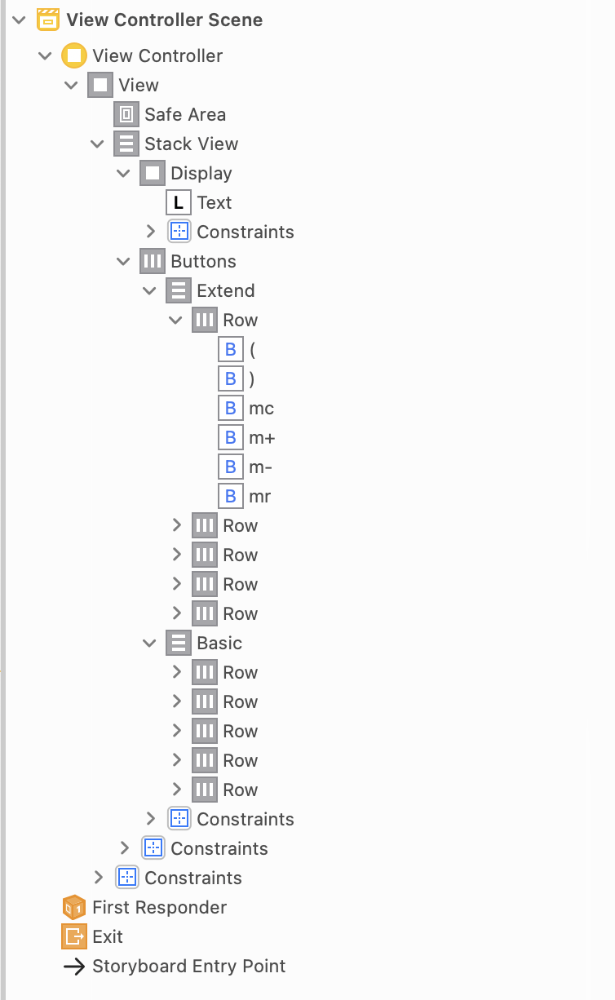

# 计算器
## 界面布局

整个界面由Vertical Stack View分为上面的展示区和下面的按钮区。  
按钮区是名为`buttons`的Horizontal Stack View，分为`Extend`按钮和`Basic`按钮。`Basic`按钮无论横屏竖屏都存在，而`Extend`按钮在竖屏状态下是隐藏的，只有在横屏状态下显示。  
除此之外，constraints也会随着屏幕朝向改变，总的来说就是让竖屏下按钮更松散一点，在横屏下更紧凑一点。
## Controller设计
Controller主要完成以下任务：
1. 处理按钮的按下事件。
2. 管理Label的展示，使得其始终是合法数字。完成从Label文本到数字的转换，以及从计算器结果到文本的转换。
3. 管理计算器两个状态：输入中与非输入中，并与计算器模型进行交互。
4. 管理按钮显示的变化，比如“C”与“AC”的切换，二元操作符按钮被选中时的效果等。

### 二元操作符与其他操作符

在控制器这里主要把二元操作符从其他操作符（零元、一元、括号）区分出来。因为二元操作符的行为与其他不同：
1. 其他操作符一旦点击即可生效，如“%”， “=”。二元操作符点击后并不是真正选中，而是在用户开始输入数字后才确认选中，其间用户还可以取消它换成其他操作符。
2. 其他操作符一旦选中，其所需的操作数已经准备好，可以完成计算。但二元操作符还需要等待用户输入第二个操作数。这影响了我们如何解读用户输入数字的行为，是在输入第二个操作数？还是在覆盖当前的数字？

### 两种状态
控制器里面有个`inputing:Bool`记录计算器当前状态。一般而言，当用户开始点击数字或小数点，则切换为输入状态；当用户开始选择操作符时，则切换为非输入状态。

当`inputing`为真，意味着当前屏幕上的数字可以变化，按下数字键可以添加。当`inputing`为假意味着屏幕上的数字不可变化，按下数字键会替换当前数字。

与模型的交互依赖于当前的`inputing`状态。当由输入变为非输入，会把屏幕上的数字压入模型中的值栈；当由非输入变为输入，若当前选中了一个二元操作符，意味着新输入数字将作为该二元操作符的操作数，那么会将该二元操作符压入符号栈；若未选中一个二元操作符，就意味着新输入的数字要覆盖当前屏幕上的数字，因此会通知模型弹出值栈的栈顶数字

### 与模型交互

用户每点击一次操作符，控制器都会调用模型的方法，告诉模型当前的操作符，而每次模型都会返回一个值，控制器就把该值展示在屏幕上。

## Model设计

### Shunting Yard算法
 模型的设计主要实现了[Shunting Yard算法](https://zh.wikipedia.org/wiki/调度场算法)。简单来说，计算器模型的难点在于处理二元操作符的优先级以及括号。该算法用两个栈分别存储临时运算结果（下称值栈）和运算符（只包括二元运算符和括号，下称符号栈）。
 
 规则如下：
 1. 当运算符被弹出栈，会执行它的运算：也就是取出值栈的栈顶两个数字进行加减乘除等，结果再压入值栈。
 1. 当二元运算符准备入栈，若当前栈顶优先级高于等于它，就把栈顶弹出。这表示优先级高的先运算。直到栈顶优先级小于它，或栈为空，或遇到左括号，才入栈。
 3. 当二元运算符准备入栈，若当前栈顶优先级小于它，则直接入栈，这表示优先级小的需等优先级高的先运算。
 4. 左括号总是直接进栈。
 5. 右括号总是把栈顶弹出，直到弹出左括号。
 
 ### 运算符
 当然，模型还需要处理二元运算符和括号以外的运算符。我把运算符分为： 
 1. **零元运算符**： 用一个数字取代值栈栈顶，该数字与栈顶无关。如清零、pi、以及mr。
 2. **一元运算符**： 对值栈栈顶进行运算，用运算结果取代它。如ln、sin、%。内存操作m+，m-也是一元运算，只不过结果永远等于操作数而且还有副作用罢了。
 3. **二元运算符**： 就做上述规则。
 4. **左括号**：同上。
 5. **右括号**：同上
 6. **End**： 等于号。它一出现就把符号栈依次弹出并执行运算，忽略左括号，直到把栈清空。
 7. ***AllClear**： AC。它的行为与等于号类似，只不过不执行运算，只是把符号栈、值栈全部清空，最后往值栈压入0，表示执行AC的结果是0。
 
 
 ### 与控制器交互
上面说道：用户每点击一次操作符，控制器就会告诉模型选中的操作符。上面还说道：二元操作符与其他操作符行为不同。

控制器与模型会进行两种交互`pushOp`和`tryPushOp`。  
其他操作符一旦点击立即生效，控制器会调用`pushOp`，运算符会马上执行运算。 
二元操作符在点击时并不生效，但是屏幕依然要根据点击的二元操作符显示预览结果。比如输入`5 + 3`，若点击`+`，需要显示`8`；若点击`X`,需要显示`5`。因此我们需要模拟把它压入符号栈，得到运算结果并展示，但又并不真正生效。因此控制器调用`tryPushOp`，它把计算器内的值栈和符号栈复制了一份进行模拟，并不会真正产生影响。

无论`pushOp`还是`tryPushOp`都会返回运算后值栈的栈顶数字，这表示运算或模拟运算的结果。

## 成果展示

